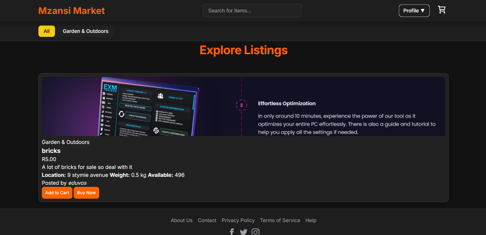
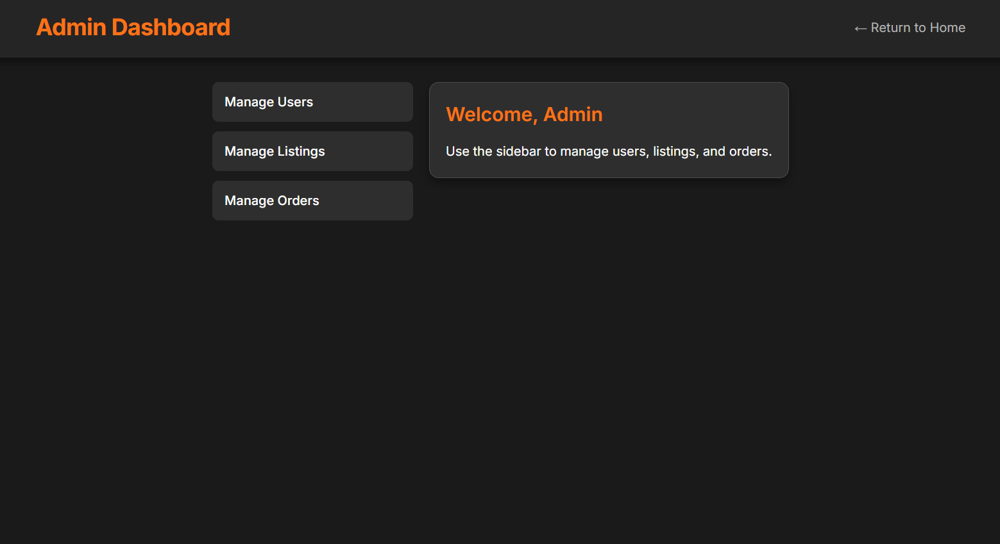

# 🛍️ Mzansi Market (PHP)
A lightweight PHP/MySQL web app for creating product listings, managing a shopping cart, and processing simple checkouts. Includes an admin area for users, orders, and listings.

---

## ✨ Features
- **User accounts**: register, login, logout, profiles.
- **Listings CRUD**: create, edit, delete, and view listings.
- **Cart & checkout**: add/save cart items, update cart, checkout, success/cancel flows.
- **Orders**: update orders, view order history.
- **Admin dashboard**: manage users (block/unblock), orders, and listings.
- **Notifications/flash messages** for user feedback.
- **Simple JSON seed** via `products.json` (optional, if used).

---

## 🧱 Tech Stack
- **Language**: PHP (no framework; procedural/flat routes)
- **Database**: MySQL or MariaDB
- **Styles**: `main.css`, `admin.css`
- **Server**: any LAMP/LNMP stack, or PHP built-in dev server

---

## 📁 Project Structure
```text
.
├── admin.css
├── admin_dashboard.php
├── admin_listings.php
├── admin_orders.php
├── admin_users.php
├── block_user.php
├── cancel.php
├── cart.php
├── checkout.php
├── config.php
├── create_listing.php
├── db.php
├── delete_listing.php
├── delete_user.php
├── edit_listing.php
├── flash.php
├── index.php
├── listings.php
├── login.php
├── logout.php
├── main.css
├── notify.php
├── products.json
├── profile.php
├── register.php
├── save_cart.php
├── submit_listing.php
├── success.php
├── unblock_user.php
├── update_order.php
└── uploads/                  # (images & assets uploaded by users)
```

## 🚀 Getting Started (Local)

### 1) Prerequisites
- PHP 8.0+ (7.4 should work, but 8.x recommended)
- MySQL/MariaDB
- Composer (optional — only if you add dependencies)

### 2) Clone & configure
```bash
git clone https://github.com/PeterTech-Dev/IT-ECA-Website.git
cd IT-ECA-Website
```

Update database credentials in **`db.php`** (and **`config.php`** if used for constants/env). Example:
```php
// db.php (example)
$host = "127.0.0.1";
$db   = "your_database";
$user = "your_user";
$pass = "your_password";
$dsn  = "mysql:host=$host;dbname=$db;charset=utf8mb4";
$options = [
    PDO::ATTR_ERRMODE            => PDO::ERRMODE_EXCEPTION,
    PDO::ATTR_DEFAULT_FETCH_MODE => PDO::FETCH_ASSOC,
];
$pdo = new PDO($dsn, $user, $pass, $options);
```

### 3) Database setup
  ```bash
  mysql -u your_user -p your_database < schema.sql
  ```

### 4) Run the app (dev)
- Using PHP’s built-in server from the project root:
  ```bash
  php -S localhost:8000
  ```
- Then open: http://localhost:8000

---

## 🔐 Environment & Security
- **Sessions**: ensure `session_start()` is called before output when needed.
- **Password hashing**: use `password_hash()` / `password_verify()`.
- **CSRF**: protect form posts (hidden token + server-side verification).
- **XSS**: escape output with `htmlspecialchars()`.
- **SQL injection**: use prepared statements (PDO).
- **File uploads**: validate MIME types/extensions, size limits, and store outside web root or use randomized filenames in `uploads/`.
- **Admin routes**: gate with role checks; deny access to non-admins.
- **.env/config**: never commit real credentials—use local overrides or environment variables.

---

## 🧭 Routes & Pages (mapping by file)
- `/` → `index.php` (home / listings overview)
- `/listings.php` → view all listings
- `/create_listing.php`, `/edit_listing.php`, `/delete_listing.php`, `/submit_listing.php` → listings CRUD
- `/cart.php`, `/save_cart.php` → cart operations
- `/checkout.php`, `/success.php`, `/cancel.php`, `/update_order.php` → checkout & orders
- `/login.php`, `/register.php`, `/logout.php`, `/profile.php` → auth & profile
- `/admin_dashboard.php`, `/admin_users.php`, `/block_user.php`, `/unblock_user.php`, `/admin_orders.php`, `/admin_listings.php` → admin area
- `/notify.php`, `/flash.php` → notifications/flash helpers (depending on your implementation)

---

## 🖼️ Screenshots



---

## 🧪 Testing (optional)
If you add tests later (e.g., with Pest/PHPUnit), document how to run them here.

---

## 📦 Deployment Notes
- Configure PHP version & extensions on your host.
- Create a production database and update credentials.
- Run required SQL migrations/seeders.
- Set proper permissions for `uploads/`.
- Add a reverse proxy or web server configuration (Apache/Nginx).

---

## 🗺️ Roadmap
- Search & filters for listings
- Pagination
- Image optimization
- Email receipts / webhooks
- Coupons or inventory tracking
- REST API endpoints

---

## 🤝 Contributing
Pull requests are welcome! For major changes, please open an issue first to discuss what you would like to change.

---

## 📝 License
MIT
